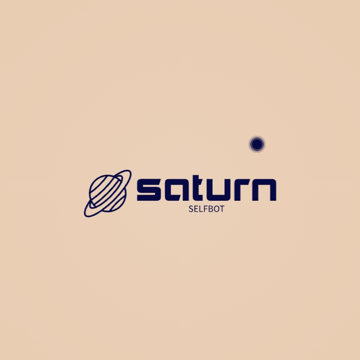

<<<<<<< HEAD

# 🪐 saturn selfbot
The best multifunctional selfbot for your Discord account!
<br></br>
<b>The creator of this project is not responsible for your account in case of ban.</b>

## 🐧 Linux
- Installation
  ```
  git clone https://github.com/saturn-selfbot/saturn-selfbot
  cd saturn-selfbot
  python -m pip install -r requirements.txt
  ```
- startup
  ```
  cd saturn-selfbot
  python -m saturn
  ```
=======
## Hi there 👋

<!--
**saturn-selfbot/saturn-selfbot** is a ✨ _special_ ✨ repository because its `README.md` (this file) appears on your GitHub profile.

Here are some ideas to get you started:

- 🔭 I’m currently working on ...
- 🌱 I’m currently learning ...
- 👯 I’m looking to collaborate on ...
- 🤔 I’m looking for help with ...
- 💬 Ask me about ...
- 📫 How to reach me: ...
- 😄 Pronouns: ...
- ⚡ Fun fact: ...
-->
>>>>>>> 56d903e41214867e6cb4039c7a25788f9ee156e6
